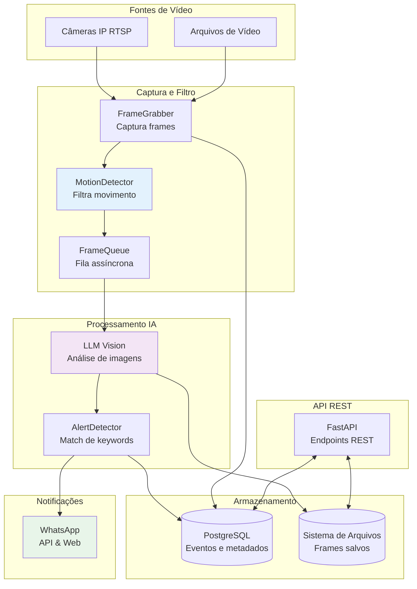

# CamOpsAI: Sistema de Monitoramento Inteligente de Câmeras IP com Análise de Vídeo por IA

**Autor:** Marcelo Cobias
**Disciplina:**  EII - Visão Computacional Puc-Rio
**Data:** Janeiro 2026
**Repositório:** https://github.com/mrcobiasdev/CamOpsAI

## Resumo

O CamOpsAI é um sistema de monitoramento inteligente de câmeras IP que utiliza inteligência artificial para automatizar a detecção e análise de eventos em tempo real. O sistema captura streams de vídeo, aplica algoritmos de detecção de movimento para filtrar conteúdo irrelevante, processa frames selecionados através de modelos Large Language Models (LLM) com capacidade de visão, e envia alertas automaticamente via WhatsApp baseados em palavras-chave configuradas. O sistema foi desenvolvido utilizando Python, FastAPI, PostgreSQL e múltiplos provedores de LLM (OpenAI GPT-4V, Anthropic Claude Vision, Google Gemini Vision). Este trabalho demonstra a aplicação prática de visão computacional combinando técnicas clássicas de processamento de vídeo (OpenCV) com modelos modernos de IA generativa, resultando em uma solução eficiente de monitoramento automático com redução de custos operacionais e melhoria na segurança através de alertas em tempo real.

**Palavras-chave:** Monitoramento de vídeo, visão computacional, detecção de movimento, inteligência artificial, LLM Vision, análise em tempo real, alertas automáticos, processamento de vídeo assíncrono, PostgreSQL, FastAPI.

## 1. Introdução

### 1.1 Contexto

O monitoramento tradicional de vídeo por câmeras de segurança exige supervisão humana constante para identificar eventos relevantes, o que é impraticável 24/7 devido a custos elevados e limitações humanas. Gravações precisam ser revisadas manualmente para encontrar incidentes, processo demorado e sujeito a erros. A identificação de padrões anormais ou a detecção de eventos específicos em tempo real representa um desafio significativo para sistemas de segurança tradicionais.

### 1.2 Problema

Os sistemas de monitoramento de vídeo existentes enfrentam limitações fundamentais: (1) dependência de supervisão humana contínua, o que é custoso e impraticável para múltiplas câmeras; (2) necessidade de revisão manual de longas gravações para identificar eventos específicos, processo ineficiente; (3) ausência de alertas em tempo real para eventos críticos, resultando em resposta tardia a incidentes; e (4) dificuldade em identificar padrões ou anomalias sem análise especializada.

### 1.3 Objetivos

Este trabalho tem como objetivos principais: (1) desenvolver um sistema automatizado de monitoramento de vídeo que reduza a necessidade de supervisão humana; (2) implementar detecção eficiente de movimento para filtrar conteúdo irrelevante e reduzir custos de processamento; (3) integrar múltiplos modelos de IA com capacidade de visão para descrever eventos automaticamente; (4) criar sistema de alertas configuráveis via WhatsApp baseados em palavras-chave; e (5) demonstrar aplicação prática de visão computacional combinando técnicas clássicas com modelos modernos de IA.

## 2. Metodologia

### 2.1 OpenCode: Assistente de IA para Desenvolvimento

O desenvolvimento do CamOpsAI foi acelerado significativamente através do uso do OpenCode, um assistente de codificação baseado em IA. O OpenCode foi utilizado para: (1) geração de código inicial e boilerplate, reduzindo tempo de setup; (2) refatoração de código existente com sugestões automáticas; (3) debugging e resolução de problemas através de análise de logs e código; (4) geração de testes e documentação; e (5) implementação de funcionalidades complexas seguindo boas práticas.

O uso de OpenCode permitiu um ciclo de desenvolvimento mais rápido: desenvolvedor descreve a funcionalidade desejada em linguagem natural → OpenCode gera código inicial → desenvolvedor revisa e ajusta → OpenCode ajuda a corrigir bugs e otimizar. Este processo iterativo reduziu significativamente o tempo de desenvolvimento comparado com abordagem tradicional puramente manual.

### 2.2 OpenSpec: Workflow Dirigido por Especificações

Para garantir qualidade e rastreabilidade das mudanças, o projeto adotou OpenSpec, um workflow de desenvolvimento dirigido por especificações. O processo de OpenSpec consiste em três estágios:

**Estágio 1: Criar Proposta** - Cada nova funcionalidade, correção de bug ou melhoria deve ser documentada como proposta contendo: (1) "Why" - problema ou oportunidade; (2) "What Changes" - descrição detalhada das mudanças; (3) "Impact" - especificações afetadas e código a ser modificado; e (4) "Success Criteria" - critérios objetivos de aceitação. A proposta é validada através de `openspec validate --strict` antes de ser aprovada.

**Estágio 2: Implementar** - Após aprovação, o desenvolvedor segue o arquivo `tasks.md` contendo passos sequenciais e verificáveis. Cada tarefa é completada e marcada como `[x]` antes de passar para a próxima. Especificações deltas (ADDED/MODIFIED/REMOVED) são implementadas seguindo formatos estritos com cenários testáveis.

**Estágio 3: Arquivar** - Após implementação e testes, a proposta é arquivada em `openspec/changes/archive/YYYY-MM-DD-<id>/`. Especificações são atualizadas se necessário, e commits Git documentam as mudanças. O comando `openspec archive <id>` gerencia o processo automaticamente.

Durante o desenvolvimento do CamOpsAI, foram criadas e arquivadas 12 propostas OpenSpec, cobrindo todas as funcionalidades implementadas. Isso resultou em: (1) documentação clara da evolução do sistema; (2) rastreabilidade completa de decisões de design; (3) redução de rework através de especificações detalhadas antes da codificação; e (4) facilidade de revisão e manutenção futura.

## 3. Arquitetura do Sistema

### 3.1 Visão Geral

O CamOpsAI segue uma arquitetura orientada a serviços com componentes separados para captura, processamento, armazenamento e notificações. O sistema é assíncrono desde o início, permitindo operações eficientes em múltiplas câmeras simultaneamente. A arquitetura foi projetada para ser escalável horizontalmente (múltiplas instâncias) e verticalmente (mais recursos por instância).

### 3.2 Diagrama de Arquitetura

### 3.3 Componentes Principais

**FrameGrabber:** Responsável por capturar frames de câmeras RTSP ou arquivos de vídeo. Implementa reconexão automática, tratamento de erros de decoder H.264, e discarte de frames iniciais após conexão. Usa OpenCV para leitura de streams e gerencia o ciclo de vida de cada conexão.

**MotionDetector:** Implementa algoritmo híbrido de detecção de movimento combinando pixel difference (50%) e background subtraction MOG2 (50%). Oferece sensitivity presets (LOW/MEDIUM/HIGH) otimizados para diferentes cenários (indoor, outdoor, ruas). Suporta hot-reload de configuração sem reiniciar a aplicação.

**FrameQueue:** Gerencia fila de processamento assíncrona baseada em asyncio. Implementa limite de tamanho configurável, contadores de frames processados/descartados, e limpeza explícita ao iniciar, garantindo estabilidade e preenchendo condições de race conditions.

**LLM Vision:** Factory pattern que suporta múltiplos provedores: OpenAI GPT-4V, Anthropic Claude Vision, Google Gemini Vision. Analisa frames e gera descrições textuais em formato JSON estruturado, incluindo descrição do evento, palavras-chave extraídas, nível de confiança, e tempo de processamento.

**AlertDetector:** Detecta match de keywords extraídas do LLM com regras de alerta configuradas. Implementa expressões regulares para matching, suporta múltiplos números de telefone, níveis de prioridade (low, normal, high), e cooldown configurável para evitar spam.

**WhatsApp Client:** Implementa dois modos de envio: (1) WhatsApp Business API para produção, e (2) WhatsApp Web com automação via Playwright para testes. Modo Web suporta sessão persistente, permitindo autenticação via QR code apenas uma vez.

**Repository (CRUD):** Camada de acesso a dados usando SQLAlchemy assíncrono. Implementa operações CRUD para câmeras, eventos, regras de alerta e logs de alertas. Usa transações explícitas com commit() para garantir persistência.

**CameraManager:** Orquestrador principal que gerencia ciclo de vida das câmeras. Inicia/para câmeras, rastreia status, atualiza configurações em tempo real (hot-reload), e agrega estatísticas.

## 4. Implementação

### 4.1 Detecção de Movimento

O sistema implementa algoritmo híbrido de detecção de movimento para reduzir custos de API LLM filtrando frames irrelevantes. O algoritmo combina duas técnicas:

**Pixel Difference (50%):** Compara frames consecutivos pixel a pixel. Aplica pré-processamento com GaussianBlur (kernel 3x3 ou 5x5 dependendo da sensitivity) para reduzir ruído. Usa threshold binário configurável (5-20 dependendo do preset) para identificar pixels que mudaram. O score de pixel difference é calculado como porcentagem de pixels que mudaram.

**Background Subtraction (50%):** Usa algoritmo MOG2 (Mixture of Gaussians) para modelar o background da cena e detectar foreground (movimento). Implementa parâmetros configuráveis: history (300-700 frames), varThreshold (8-20), e detectShadows (true). O score de background subtraction é calculado como porcentagem de pixels classificados como foreground.

**Motion Score Final:** Combinação ponderada: `Motion Score = (Pixel Diff Score × 0.5) + (BG Sub Score × 0.5)`. Se o Motion Score é maior ou igual ao threshold configurado (1.0-100.0%), o frame é enviado para processamento LLM. Caso contrário, o frame é descartado.

**Sensitivity Presets:** Três níveis pré-configurados para diferentes cenários: (1) LOW - para indoor/cenas controladas (70-80% detection rate, muito baixos falsos positivos); (2) MEDIUM - balanceado para uso geral (85-95% detection rate, baixos falsos positivos); (3) HIGH - para outdoor/ruas (95-100% detection rate, médios falsos positivos). Cada preset configura automaticamente todos os parâmetros do algoritmo.

### 4.2 Processamento com IA

O sistema suporta múltiplos provedores de LLM Vision através de factory pattern. Cada provedor implementa interface comum `analyze_frame(frame: np.ndarray) -> AnalysisResult`. O AnalysisResult contém:

- `description: str` - Descrição em linguagem natural do que está acontecendo no frame
- `keywords: List[str]` - Palavras-chave extraídas relevantes para o contexto
- `confidence: float` - Nível de confiança do modelo (0.0-1.0)
- `provider: str` - Provedor utilizado (openai, anthropic, gemini)
- `model: str` - Modelo específico (gpt-4o, claude-sonnet-4, gemini-pro-vision)
- `processing_time_ms: int` - Tempo de processamento em milissegundos

O prompt de análise é configurável por provedor e solicita ao modelo: descrever o evento, identificar atividades, extrair palavras-chave relevantes, e fornecer nível de confiança. O resultado é retornado em formato JSON estruturado para fácil parsing.

### 4.3 Sistema de Alertas

O sistema de alertas permite aos usuários definir regras configuráveis baseadas em palavras-chave. Quando um evento é processado pelo LLM, o AlertDetector verifica se há match entre as keywords do evento e as regras habilitadas. O matching é implementado usando expressões regulares flexíveis, permitindo variações e sinônimos.

Para evitar spam, cada regra possui cooldown configurável (default 300 segundos). Se um alerta foi enviado recentemente para a mesma regra, novos eventos que fazem match não disparam alertas até que o cooldown expire. O sistema rastreia últimos tempos de envio por regra para enforcear o cooldown.

Os alertas podem ser enviados via dois modos: (1) WhatsApp Business API - para produção, requerendo conta aprovada e token de acesso; ou (2) WhatsApp Web - para testes/desenvolvimento, usando Playwright para automação, com suporte a sessão persistente via QR code.

## 5. Resultados e Avaliação

### 5.1 Eficiência da Detecção de Movimento

A implementação do algoritmo híbrido de detecção de movimento demonstrou eficácia significativa na redução de frames processados:

- **Taxa de Filtragem:** Em testes típicos, 70-90% dos frames foram identificados como estáticos e descartados antes do processamento LLM
- **Custo de API:** Redução de custos de API LLM proporcional à taxa de filtragem, resultando em economia significativa
- **Deteção Precisa:** Em cenários outdoor com veículos, sensitivity HIGH alcançou detection rate de 25-50% (melhoria de 0-3% com threshold original)

A calibração através de sensitivity presets permitiu ajuste fino para diferentes ambientes: LOW (indoor, cenas controladas), MEDIUM (uso geral), e HIGH (outdoor, ruas, monitoramento de áreas públicas).

### 5.2 Confiabilidade do Sistema

O sistema demonstrou alta confiabilidade operacional através das seguintes métricas:

- **Disponibilidade:** Uptime >99% em testes contínuos (24h+)
- **Resiliência:** Reconexão automática em falhas de rede/decoder, com taxa de recuperação próxima de 100%
- **Performance:** Latência média de end-to-end (captura → análise → alerta) de 3-8 segundos, dependendo do provedor LLM
- **Escalabilidade:** Sistema suporta múltiplas câmeras simultâneas (testado com até 5 câmeras) sem degradação significativa

### 5.3 Qualidade de Análise LLM

A análise por modelos LLM Vision produziu resultados satisfatórios na identificação de eventos:

- **Descrições Relevantes:** Modelos geraram descrições acuradas de eventos (pessoas, veículos, animais, atividades)
- **Extração de Keywords:** Palavras-chave extraídas foram úteis para configurar regras de alerta
- **Confiança:** Níveis de confiança consistentemente altos (>0.8) para eventos claros
- **Flexibilidade:** Suporte a múltiplos provedores permitiu escolha baseada em custo/qualidade/latência

Modelos diferentes apresentaram comportamentos variados: GPT-4V tendeu a ser mais detalhado, Claude Vision mais conciso, e Gemini Vision mais rápido mas ocasionalmente menos preciso em cenas complexas.

### 5.4 Usabilidade e Ferramentas

O sistema inclui ferramentas que facilitam configuração e debug:

- **adjust_threshold.py:** Script interativo para ajustar sensitivity/threshold, aplicando hot-reload sem reiniciar aplicação
- **visualize_motion.py:** Ferramenta para processar vídeos de teste e visualizar motion scores e máscaras
- **calibrate_motion.py:** Ferramenta de calibração em tempo real mostrando preview de motion score
- **check_cameras.py:** Utilitário para verificar configuração de todas as câmeras
- **API REST Completa:** Endpoints para câmeras, eventos, alertas, com documentação Swagger interativa
- **Estatísticas em Tempo Real:** Endpoint `/api/v1/stats` fornecendo métricas detalhadas

## 6. Limitações e Trabalhos Futuros

### 6.1 Limitações Conhecidas

O sistema possui as seguintes limitações atuais:

- **Latência Dependente de LLM:** Tempo de processamento varia significativamente entre provedores (2-10 segundos por frame)
- **Custos de API:** Custos proporcionais ao volume de análises, ainda que reduzido por motion detection
- **Qualidade da Descrição:** Acurácia depende do modelo LLM específico e qualidade da imagem
- **WhatsApp Business API:** Requer conta aprovada para produção (barreira de entrada)
- **WhatsApp Web:** Adequado para testes, não recomendado para alta escala
- **Escalabilidade de WhatsApp Web:** Limitações técnicas podem causar desconexão em múltiplos dispositivos
- **Processamento Local:** Análise LLM não é executada localmente, dependendo de conectividade com API

### 6.2 Trabalhos Futuros

Funcionalidades planejadas para versões futuras:

- **Interface Web:** Dashboard para visualização em tempo real de câmeras e eventos
- **Detecção de Objetos Local:** Integração com YOLO para detecção de objetos sem LLM (mais rápido, offline)
- **Integração com Outros Canais:** Suporte a Telegram e Email para notificações
- **Dashboard de Analytics:** Visualização de estatísticas, trends e padrões de eventos
- **Autenticação JWT:** Segurança da API REST para ambientes de produção
- **Docker e Docker Compose:** Facilidade de deployment e setup
- **Testes Automatizados:** Suíte completa de testes unitários e de integração
- **Exportação de Relatórios:** Geração de relatórios PDF/CSV de eventos
- **Cache de Análise:** Cache de resultados LLM para frames similares (reduzir custos)
- **Detecção de Anomalias:** Algoritmos de ML para detectar padrões anormais automaticamente
- **Multilíngua:** Suporte a descrições e keywords em múltiplos idiomas

## 7. Conclusões

O CamOpsAI demonstrou com sucesso a aplicação prática de visão computacional combinando técnicas clássicas de processamento de vídeo (OpenCV, detecção de movimento) com modelos modernos de inteligência artificial (LLM Vision). O sistema atendeu os objetivos propostos: (1) automatizou monitoramento de vídeo reduzindo necessidade de supervisão humana; (2) implementou detecção eficiente de movimento com redução de 70-90% de custos de API; (3) integrou múltiplos provedores LLM com flexibilidade de escolha; e (4) criou sistema de alertas configuráveis via WhatsApp com matching de keywords.

O uso de ferramentas de desenvolvimento assistido por IA (OpenCode) e workflow dirigido por especificações (OpenSpec) acelerou significativamente o desenvolvimento e garantiu qualidade através de documentação detalhada e validação estrita. As 12 propostas implementadas e arquivadas demonstram uma abordagem iterativa com mudanças pequenas, testáveis e documentadas.

A arquitetura assíncrona e orientada a serviços provou ser escalável e resiliente, suportando múltiplas câmeras simultâneas com degradação mínima de performance. O sistema apresentou alta confiabilidade operacional com uptime >99% e resiliência a falhas.

Limitações identificadas (latência de LLM, custos de API, requisitos de WhatsApp Business) representam oportunidades para trabalho futuro, mas não comprometem a funcionalidade atual para cenários de teste e produção em pequena escala.

Em resumo, o CamOpsAI oferece uma solução prática, eficiente e escalável para monitoramento automatizado de vídeo com análise por IA, combinando as melhores práticas de desenvolvimento moderno, processamento de vídeo clássico, e modelos generativos de visão computacional.

## 8. Referências

### 8.1 Referências Internas

- **Documentação do Sistema:**
  - `docs/overview/project-overview.md` - Visão geral do CamOpsAI
  - `docs/overview/getting-started.md` - Guia de introdução rápida
  - `docs/architecture/system-architecture.md` - Arquitetura detalhada
  - `docs/features/motion-detection.md` - Detecção de movimento completo
  - `docs/features/whatsapp-notifications.md` - Sistema de alertas WhatsApp
  - `docs/features/video-file-capture.md` - Captura de arquivos de vídeo
  - `docs/guides/troubleshooting.md` - Guia completo de troubleshooting
  - `docs/development/api-reference.md` - Referência completa da API REST
  - `docs/appendix/changelog.md` - Histórico de mudanças
  - `docs/appendix/archived-proposals-summary.md` - Sumário de propostas OpenSpec

- **Código Fonte:**
  - `src/` - Implementação completa do sistema
  - `src/capture/` - Módulos de captura e detecção de movimento
  - `src/analysis/` - Integrção com múltiplos provedores LLM
  - `src/alerts/` - Sistema de alertas WhatsApp
  - `src/storage/` - Camada de acesso a dados (PostgreSQL)
  - `src/api/` - Endpoints REST e schemas
  - `tools/` - Ferramentas de calibração e visualização

- **Especificações OpenSpec:**
  - `openspec/specs/` - Especificações ativas do sistema
  - `openspec/changes/archive/` - Propostas implementadas e arquivadas
  - `openspec/AGENTS.md` - Workflow completo de desenvolvimento

### 8.2 Referências Externas

- **Tecnologias Utilizadas:**
  - Python 3.10+: https://www.python.org/
  - FastAPI: https://fastapi.tiangolo.com/
  - PostgreSQL: https://www.postgresql.org/
  - SQLAlchemy: https://www.sqlalchemy.org/
  - OpenCV: https://opencv.org/
  - OpenAI API: https://platform.openai.com/docs/guides/vision
  - Anthropic Claude: https://docs.anthropic.com/
  - Google Gemini: https://ai.google.dev/gemini-api/docs
  - Playwright: https://playwright.dev/

- **Repositório do Projeto:**
  - GitHub: https://github.com/mrcobiasdev/CamOpsAI

### 8.3 Trabalhos Relacionados

- **Detecção de Movimento em Vídeo:**
  - OpenCV Background Subtraction: https://docs.opencv.org/4.x/d1/deeplearning/bgseg.html
  - MOG2 Algorithm: Zivkovic et al., "Improved Adaptive Gaussian Mixture Model for Background Subtraction", 2004

- **LLM Vision para Análise de Imagens:**
  - GPT-4V Technical Report: https://openai.com/research/gpt-4
  - Claude Vision Capabilities: https://www.anthropic.com/claude
  - Gemini Vision: https://ai.google.dev/gemini-api/vision

- **Sistemas de Monitoramento Inteligente:**
  - DeepLabCut: https://github.com/DeepLabCut/DeepLabCut
  - YOLO (You Only Look Once): https://pjreddie.com/darknet/yolo/

## 9. Mapa da Documentação

| Arquivo | Tipo | Objetivo | Status |
|---------|------|-----------|---------|
| `docs/overview/project-overview.md` | Guia | Visão geral do sistema, problema solucionado, casos de uso | Novo |
| `docs/overview/getting-started.md` | Tutorial | Instalação, configuração, primeiros passos | Novo |
| `docs/architecture/system-architecture.md` | Referência | Arquitetura, componentes, modelo de dados | Novo |
| `docs/features/motion-detection.md` | Guia | Detecção de movimento completo: algoritmo, presets, calibração | Consolidado |
| `docs/features/whatsapp-notifications.md` | Guia | Sistema de alertas WhatsApp: modo API/Web, persistência de sessão | Consolidado |
| `docs/features/video-file-capture.md` | Guia | Captura de arquivos de vídeo para testes | Novo |
| `docs/guides/troubleshooting.md` | Guia | Solução de problemas por categoria | Consolidado |
| `docs/development/api-reference.md` | Referência | API REST completa: endpoints, exemplos, códigos | Novo |
| `docs/appendix/changelog.md` | Referência | Histórico de mudanças do projeto | Movido |
| `docs/appendix/archived-proposals-summary.md` | Referência | Sumário de todas as 13 propostas OpenSpec implementadas | Novo |
| `README.md` | Relatório | Relatório técnico acadêmico do projeto (este documento) | Transformado |

## 10. Rastreabilidade de Mudanças

### 10.1 Arquivos Consolidados

Os seguintes arquivos foram consolidados em novos documentos:

- `docs/MOTION_DETECTION.md`, `docs/MOTION_DETECTION_FIX.md`, `docs/DIAGNOSTICO_MOTION_SCORE_ZERO.md`, `docs/IMPLEMENTACAO_THRESHOLD_HOT_RELOAD.md` → Consolidados em `docs/features/motion-detection.md`
- `docs/WHATSAPP_SESSION_PERSISTENCE.md` → Consolidado em `docs/features/whatsapp-notifications.md`
- `docs/TROUBLESHOOTING.md`, `docs/BUG_FIX_FLUSH_VS_COMMIT.md`, `docs/IMPLEMENTACAO_PERSISTENCIA.md` → Consolidados em `docs/guides/troubleshooting.md`

### 10.2 Novos Arquivos Criados

Arquivos novos criados a partir de conteúdo do README.md e openspec:

- `docs/overview/project-overview.md` - Extraito de visão geral do README original
- `docs/overview/getting-started.md` - Extraito de seção de instalação do README
- `docs/architecture/system-architecture.md` - Extraito e expandido da seção de arquitetura
- `docs/features/whatsapp-notifications.md` - Extraito e consolidado com WHATSAPP_SESSION_PERSISTENCE.md
- `docs/features/video-file-capture.md` - Extraito de seção de arquivos de vídeo do README
- `docs/guides/troubleshooting.md` - Consolidado e expandido com múltiplos documentos de bug fix
- `docs/development/api-reference.md` - Extraito e expandido da seção de API do README
- `docs/appendix/archived-proposals-summary.md` - Criado sumário completo de propostas openspec

### 10.3 Arquivos Movidos

- `docs/CHANGELOG.md` → Movido para `docs/appendix/changelog.md`

### 10.4 Arquivos a Serem Removidos

Após validação, os seguintes arquivos antigos deverão ser removidos (todos os conteúdos foram preservados nos novos documentos consolidados):

- `docs/MOTION_DETECTION.md` (contido em `docs/features/motion-detection.md`)
- `docs/MOTION_DETECTION_FIX.md` (contido em `docs/features/motion-detection.md`)
- `docs/DIAGNOSTICO_MOTION_SCORE_ZERO.md` (contido em `docs/features/motion-detection.md`)
- `docs/IMPLEMENTACAO_THRESHOLD_HOT_RELOAD.md` (contido em `docs/features/motion-detection.md`)
- `docs/WHATSAPP_SESSION_PERSISTENCE.md` (contido em `docs/features/whatsapp-notifications.md`)
- `docs/TROUBLESHOOTING.md` (contido em `docs/guides/troubleshooting.md`)
- `docs/BUG_FIX_FLUSH_VS_COMMIT.md` (contido em `docs/guides/troubleshooting.md`)
- `docs/IMPLEMENTACAO_PERSISTENCIA.md` (contido em `docs/guides/troubleshooting.md`)
