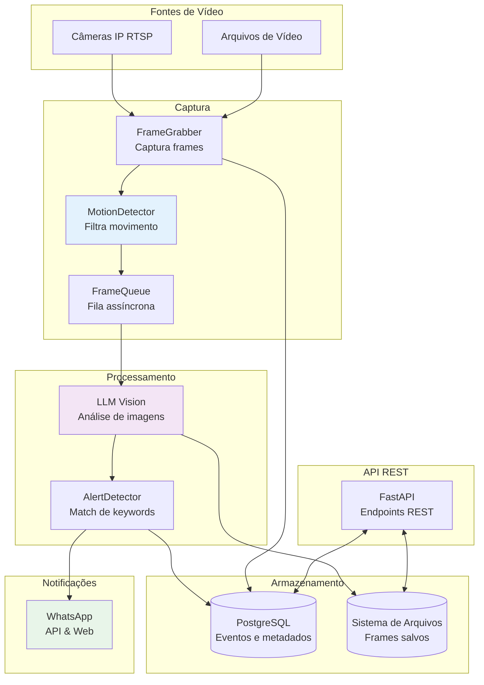

# Arquitetura do Sistema

## Visão Geral

O CamOpsAI segue uma arquitetura orientada a serviços com componentes separados para captura, processamento, armazenamento e notificações. O sistema é assíncrono desde o início, permitindo operações eficientes em múltiplas câmeras simultaneamente.

## Diagrama de Arquitetura



## Componentes

### 1. FrameGrabber

**Responsabilidade:** Capturar frames de câmeras RTSP ou arquivos de vídeo

**Características:**
- Conexão assíncrona com múltiplas câmeras
- Reconexão automática em caso de falha
- Tratamento de erros de decoder H.264
- Configuração de intervalo de captura por câmera
- Discarte de frames iniciais após conexão

**Arquivo:** `src/capture/frame_grabber.py`

### 2. MotionDetector

**Responsabilidade:** Detectar movimento em frames para filtrar conteúdo irrelevante

**Algoritmo Híbrido:**
- Pixel Difference (50%): Compara frames consecutivos
- Background Subtraction (50%): Usa MOG2 para modelar background

**Características:**
- Sensitivity presets (LOW/MEDIUM/HIGH)
- Configuração de threshold por câmera
- Hot-reload de configuração
- Estatísticas de detecção

**Arquivo:** `src/capture/motion_detector.py`

### 3. FrameQueue

**Responsabilidade:** Gerenciar fila de processamento de frames

**Características:**
- Fila assíncrona baseada em asyncio
- Limite de tamanho configurável
- Contadores de frames processados/descartados
- Limpeza explícita ao iniciar

**Arquivo:** `src/capture/queue.py`

### 4. LLM Vision

**Responsabilidade:** Analisar frames e gerar descrições textuais

**Suporte a Múltiplos Provedores:**
- OpenAI GPT-4V
- Anthropic Claude Vision
- Google Gemini Vision

**Factory Pattern:**
```python
LLMVisionFactory.create(provider="openai") -> OpenAIVision
LLMVisionFactory.create(provider="anthropic") -> AnthropicVision
LLMVisionFactory.create(provider="gemini") -> GeminiVision
```

**Características:**
- Análise em formato JSON estruturado
- Extração de palavras-chave
- Configuração de modelo por provedor
- Rastreamento de tempo de processamento

**Arquivos:** `src/analysis/`, `src/analysis/factory.py`

### 5. AlertDetector

**Responsabilidade:** Detectar match de keywords e disparar alertas

**Características:**
- Expressões regulares para match de keywords
- Suporte a múltiplos números de telefone
- Níveis de prioridade (low, normal, high)
- Cooldown configurável para evitar spam

**Arquivo:** `src/alerts/detector.py`

### 6. WhatsApp Client

**Responsabilidade:** Enviar alertas via WhatsApp

**Dois Modos:**
- API Mode: Usa WhatsApp Business API
- Web Mode: Usa Playwright para automação

**Características:**
- Sessão persistente no modo Web
- Reconexão automática
- Tratamento de erros
- Status de autenticação

**Arquivos:** `src/alerts/whatsapp.py` (API), `src/alerts/whatsapp_web.py` (Web)

### 7. CameraManager

**Responsabilidade:** Gerenciar ciclo de vida das câmeras

**Características:**
- Iniciar/parar câmeras
- Rastrear status de cada câmera
- Atualizar configuração em tempo real (hot-reload)
- Estatísticas agregadas

**Arquivo:** `src/main.py` (parte do orquestrador)

### 8. Repository (CRUD)

**Responsabilidade:** Operações de banco de dados

**Características:**
- ORM assíncrono (SQLAlchemy + asyncpg)
- CRUD para câmeras, eventos, alertas
- Queries complexas com filtros
- Transações explícitas com commit()

**Arquivo:** `src/storage/repository.py`

## Modelo de Dados

### Tabela: cameras

Armazena configuração das câmeras.

```python
class Camera(Base):
    id: UUID
    name: str
    url: str                    # RTSP ou caminho de arquivo
    source_type: str              # 'rtsp' ou 'video_file'
    enabled: bool
    frame_interval: int
    motion_detection_enabled: bool
    motion_threshold: float
    motion_sensitivity: str        # 'low', 'medium', 'high'
    created_at: datetime
    updated_at: datetime
```

### Tabela: events

Armazena eventos detectados.

```python
class Event(Base):
    id: UUID
    camera_id: UUID
    timestamp: datetime
    description: str              # Descrição do LLM
    keywords: List[str]            # Keywords extraídas
    frame_path: str
    confidence: float
    llm_provider: str
    llm_model: str
    processing_time_ms: int
```

### Tabela: alert_rules

Armazena regras de alerta.

```python
class AlertRule(Base):
    id: UUID
    name: str
    keywords: List[str]
    camera_ids: List[UUID]       # null = todas as câmeras
    phone_numbers: List[str]
    enabled: bool
    priority: str                # 'low', 'normal', 'high'
    cooldown_seconds: int
    created_at: datetime
    updated_at: datetime
```

### Tabela: alert_logs

Armazena histórico de alertas enviados.

```python
class AlertLog(Base):
    id: UUID
    event_id: UUID
    alert_rule_id: UUID
    keywords_matched: List[str]
    sent_to: List[str]
    sent_at: datetime
    status: str                  # 'pending', 'sent', 'failed'
    error_message: str
```

## Fluxo de Dados

### 1. Captura

1. `CameraManager` inicia `FrameGrabber` para cada câmera ativa
2. `FrameGrabber` conecta à câmera (RTSP ou arquivo de vídeo)
3. Frames são capturados no intervalo configurado
4. Erros de decoder são rastreados (sem reconexão imediata)

### 2. Detecção de Movimento

1. Frame capturado é passado ao `MotionDetector`
2. `MotionDetector` calcula score híbrido (pixel diff + bg sub)
3. Se `score >= threshold`, frame é enfileirado
4. Se `score < threshold`, frame é descartado (e não processado)

### 3. Processamento Assíncrono

1. `FrameQueue` desenfileira frame
2. `LLMVision` analisa frame com modelo configurado
3. Resultado JSON contém: descrição, keywords, confiança
4. Frame é salvo em disco
5. Evento é salvo no banco de dados

### 4. Detecção de Alertas

1. `AlertDetector` verifica keywords do evento
2. Compara com regras de alerta habilitadas
3. Se match e cooldown permite, dispara alerta
4. `WhatsAppClient` envia mensagem
5. Alert log é salvo no banco de dados

## Configuração

### Variáveis de Ambiente

Principais variáveis de configuração:

```env
# Banco de Dados
DATABASE_URL=postgresql+asyncpg://...

# LLM
LLM_PROVIDER=openai|anthropic|gemini
OPENAI_API_KEY=...
ANTHROPIC_API_KEY=...
GEMINI_API_KEY=...

# WhatsApp
WHATSAPP_SEND_MODE=api|web
WHATSAPP_API_URL=...
WHATSAPP_TOKEN=...
WHATSAPP_PHONE_ID=...
WHATSAPP_SESSION_DIR=./sessions/whatsapp/
WHATSAPP_HEADLESS=true|false

# Processamento
FRAME_INTERVAL_SECONDS=10
FRAMES_STORAGE_PATH=./frames
MAX_QUEUE_SIZE=100
INITIAL_FRAMES_TO_DISCARD=5

# API
API_HOST=0.0.0.0
API_PORT=8000
DEBUG=false
```

### Configuração por Câmera

Cada câmera pode ter configuração específica:

- `frame_interval`: Segundos entre capturas
- `motion_detection_enabled`: Habilitar/desabilitar detecção
- `motion_threshold`: Threshold de movimento (1.0-100.0%)
- `motion_sensitivity`: Preset (low/medium/high)

## Escalabilidade

### Horizontal

- Múltiplas instâncias do CamOpsAI podem rodar com diferentes subconjuntos de câmeras
- Load balancing via nginx ou similar
- Banco de dados centralizado compartilhado

### Vertical

- Mais RAM permite mais câmeras simultâneas
- CPU mais potente permite processamento LLM mais rápido
- Armazenamento em SSD acelera salvamento de frames

## Considerações de Performance

### Otimizações Implementadas

1. **Assincronismo Total**: Não há bloqueios I/O
2. **Detecção de Movimento**: Filtra 70-90% dos frames
3. **Fila com Limite**: Previne OOM em múltiplas câmeras
4. **Hot-Reload**: Configurações mudam sem reinício
5. **Conexões Persistentes**: WhatsApp Web, conexões de banco

### Monitoramento

API endpoint `/api/v1/stats` fornece métricas:

- Contagem de câmeras ativas
- Frames capturados/processados/descartados
- Taxa de detecção de movimento
- Erros de decoder
- Alertas enviados

## Segurança

1. **Credenciais**: Armazenadas em variáveis de ambiente, não em código
2. **API Keys**: Não expostas em logs
3. **Validação**: Entrada validada em todos os endpoints
4. **HTTPS**: Suportado para produção (configurar via reverse proxy)

## Referências

- **Source Code**: `/src/` - Implementação de todos os componentes
- **Database Models**: `src/storage/models.py` - SQLAlchemy models
- **API Routes**: `src/api/routes/` - Endpoints REST
- **Configuration**: `src/config/settings.py` - Pydantic Settings
